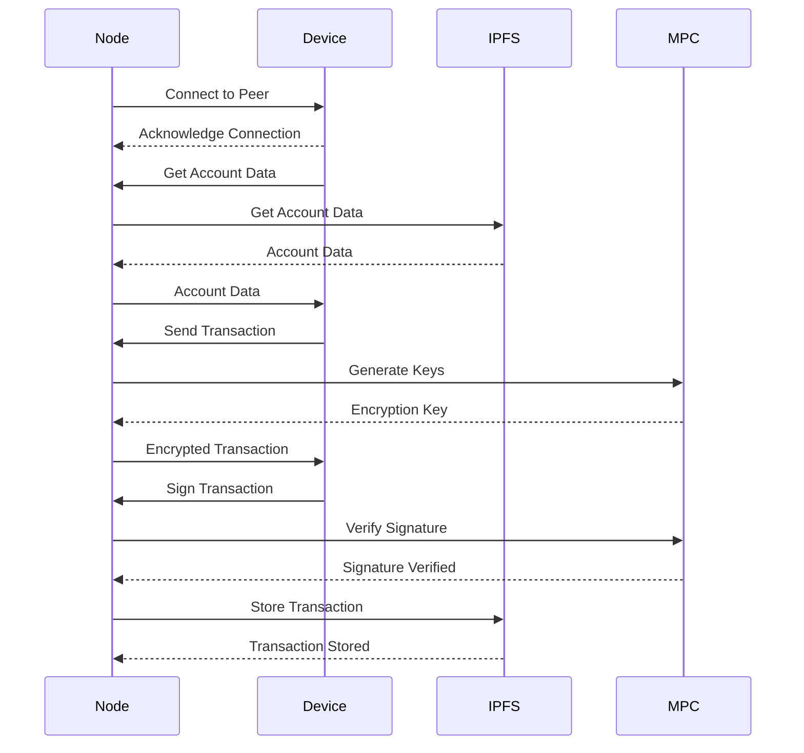
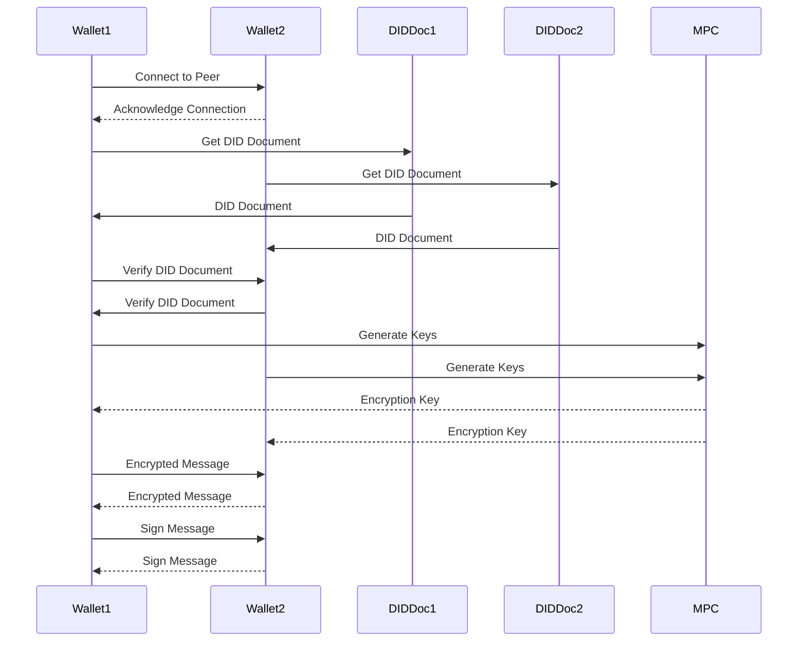

## MPC Account Generation

In this diagram, Node represents the Cosmos validator node that is running IPFS, and Device represents the device that is communicating with the node. They use libp2p to establish a peer-to-peer connection and exchange data and transactions. IPFS represents the IPFS instance that is running on the node, which is used to store and retrieve data. MPC represents the multi-party computation process that is used to generate and manage the keys that are used for encrypting and signing the transactions.

The diagram shows the steps involved in establishing a connection, retrieving account data, sending transactions, encrypting and signing the transactions, verifying the signatures, and storing the transactions on the node using IPFS. This process allows the node and the device to securely and privately interact with each other, while also leveraging the decentralized and resilient nature of the Cosmos ecosystem and IPFS.

## P2P DID Wallet Messaging

In this diagram, Wallet1 and Wallet2 represent the two wallets that are communicating with each other. They use libp2p to establish a peer-to-peer connection and exchange messages. DIDDoc1 and DIDDoc2 represent the DID documents that are used to identify and authenticate the users of the wallets. MPC represents the multi-party computation process that is used to generate and manage the keys that are used for encrypting and signing the messages.

The diagram shows the steps involved in establishing a connection, exchanging DID documents, verifying the documents, generating keys, sending encrypted and signed messages, and verifying the signatures. This process allows the wallets to securely and privately communicate with each other, while maintaining the decentralization and self-sovereignty of the users.
